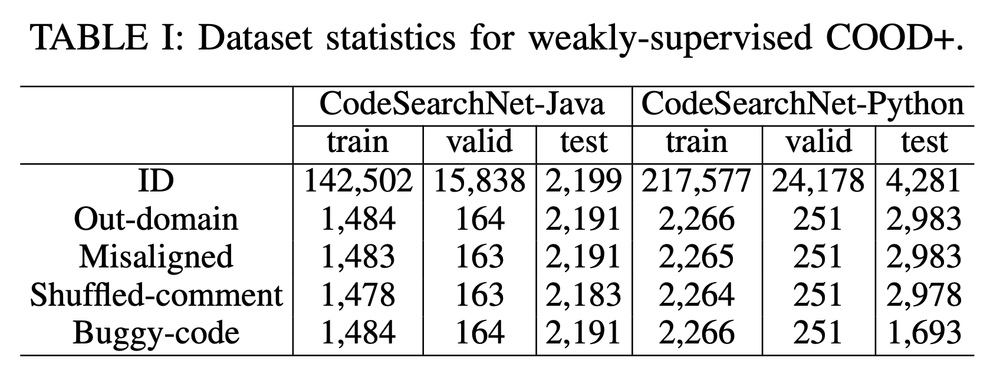
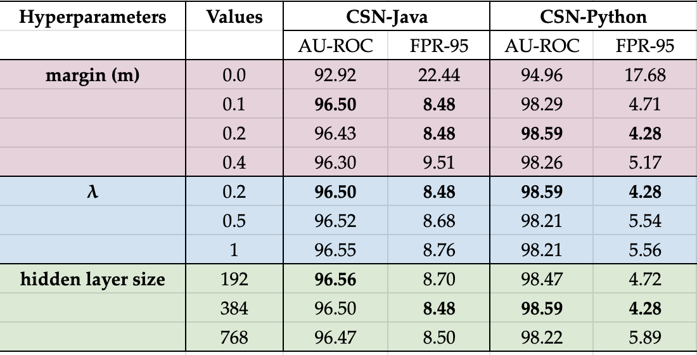

# Towards More Trustworthy Deep Code Models by Enabling Out-of-Distribution Detection

## Introduction
In this work, We proposed two multi-modal OOD detection methods for code-related pretrained ML models; namely unsupervised COOD and weakly-supervised COOD+. The COOD merely leveraged unsupervised contrastive learning to identify OOD samples. As an extension of COOD, COOD+ combined contrastive learning and a binary classifier for OOD detection using a small number of labelled OOD samples. To reap the benefits of these two modules, we also devised a new scoring metric to fuse their prediction results. 

## Dataset Statistics
The dataset statistics for training and evaluation of our weakly-supervised COOD+ and baseline models are as follows:



## Results
Given that all outliers were randomly selected, the experimental results reported in our paper are averaged across **five random seeds** of the test dataset to ensure evaluation reliability and reproducibility. As indicated in Tables I and II, our unsupervised/weakly-supervised COOD/COOD+ models demonstrate superior performance compared to the unsupervised/weakly-supervised baseline models **with statistical significance** (Wilcoxon’s paired test 𝑝 < 0.05) accordingly. Wilcoxon’s paired tests were conducted between COOD/COOD+ and unsupervised/weakly-supervised baseline models based on the OOD scores generated by these models.

It is important to note that **the encoder backbone of baseline models 1-3 (i.e., SCL+(MSP/Energy/Maha), MCL+(MSP/Energy/Maha), ECE) is also GraphCodeBERT**, ensuring a fair comparison with our COOD/COOD+ models. While each of the baseline models 1-3 relies on an encoder backbone to generate probabilities for OOD scoring, baseline models 4-5 (i.e., CuBERT, 2P-CuBERT) are specifically designed for neural bug detection, obviating the need for another encoder backbone for OOD detection. Also, the SCL-related (supervised constrastive learning) baselines is supervised for the code search task, but unsupervised for OOD detection similarly to our unsupervised COOD.

The results for hyperparameter tuning (including the margin m for margin-based contrastive loss and the balancing factor $\lambda$ in the overall loss function, and the hidden layer size (768, 768/2, 768/4) in the binary OOD rejection module) for COOD+ are shown below:




## Training Prerequisites
- python 3.9
- pytorch 1.8.0
- torchvision 0.9.0

## Dataset & Evaluation benchmark

To acquire the training and testing datasets, please first download the datasets used for OOD data generation [here](https://drive.google.com/drive/folders/1GYwQs4klceKFV5c50-G_gxC1EYKtb1sr?usp=sharing), including the datasets constructed from StackOverflow for code search and the datasets constructed from CSN by injecting variable misuse bugs (single token-based). Then, you can run the preprocess.py and preprocess.ipynb under each subfolder of the data folder. Consequently, the OOD data would be extracted automatically based on the dataloader.py file when you train and evaluate our models.

## Reproduce the results

The parameter values in config_java.yaml and config_python.yaml can be changed to adapt to different settings. Our trained COOD and COOD+ model checkpoints are available [here](https://drive.google.com/drive/folders/1KLjtmiCNdPHqU_5wzz9FqZoRxfIv0JfO?usp=drive_link) anonymously for results reproduction.


```bash
git clone https://anonymous.4open.science/r/COOD-5DC1
cd COOD
pip install -r requirements.txt
```

To train the model
```bash
python run.py --config config_java.yaml
```

To test the model under OOD detection setting
```bash
python run.py --config config_java.yaml --test_baseline_metrics
```

To test the model on the main code understanding task (i.e. code search) with COOD+ auxiliary
```bash
python run.py --config config_java.yaml  --test_main_task
```
