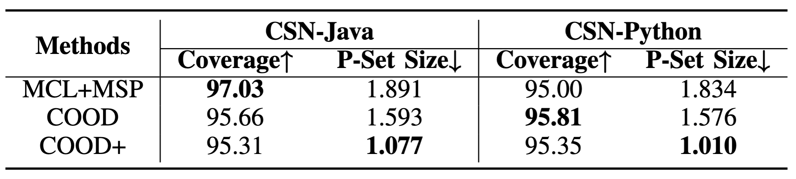

# Towards More Trustworthy Deep Code Models by Enabling Out-of-Distribution Detection

## Introduction
In this work, We proposed two multi-modal OOD detection methods for code-related pretrained ML models; namely unsupervised COOD and weakly-supervised COOD+. The COOD merely leveraged unsupervised contrastive learning to identify OOD samples. As an extension of COOD, COOD+ combined contrastive learning and a binary classifier for OOD detection using a small number of labelled OOD samples. To reap the benefits of these two modules, we also devised a new scoring metric to fuse their prediction results. 

## Dataset Statistics
The dataset statistics for training and evaluation of our weakly-supervised COOD+ and baseline models are as follows:


## Analysis of the Overconfidence of MSP with Conformal Prediction

Given an OOD testing sample, DNN models pre-trained on ID data are prone to predict a higher MSP confidence score than the threshold and wrongly identify it as an ID sample. This overconfidence issue limits the effectiveness of OOD detection. For NL data, this is caused by the the spurious correlation between OOD and ID features such as entities and syntactic structures [1]. Such correlation also occurs in PL data. For example, an OOD PL input with the syntactic structure ``def ... if ... return ... else ... return ..." may receive an ID score if this pattern is commonly used in other ID inputs. To overcome overconfident predictions, previous works explored techniques such as temperature scaling, confidence calibration using adversarial samples, or adaptive class-dependent threshold. In contrast, our proposed COOD+ utilizes a weakly-supervised contrastive learning objective to take advantage of a small number of OOD samples during training and prevent the alignment between OOD pairs. Moreover, we adopt the binary OOD rejection module to discriminate the fused OOD and ID representations. We further verify whether COOD+ overcome the overconfidence issue through the lens of Conformal Prediction [1].

Conformal Prediction (CP) involves post-processing uncertainty quantification techniques that are model-agnostic, and provide statistical guarantees on the predictions of a trained model [2]. The commonly used split CP technique first computes the nonconformity scores, which are OOD scores in our case, on a calibration set independent of the training data. Then, it builds a prediction set for each testing sample $$\mathcal{C}_\alpha(t^{test}_l, c^{test}_l)$$ satisfying the condition $$P(y_l^{test}\in \mathcal{C}_\alpha(t^{test}_l, c^{test}_l))\geq 1-\alpha$$, where $\alpha$ is a small error rate (e.g., 0.05) that the user is willing to tolerate. Here, this condition guarantees that the true outcome is covered by the prediction set with probability $1-\alpha$, which is also known as the CP coverage. When CP is applied to the OOD detection scores, all scores have the same statistical guarantee, but better OOD scores will give tighter prediction sets. Conversely, worse scores will give large and uninformative prediction sets, which corresponds to ineffective OOD detection caused by overconfident predictions.

In our experiment, we apply split CP by reserving 20\% of the testing samples from each testing dataset (CSN-Java and CSN-Python) for CP calibration, and construct the prediction sets with tolerable error rate $\alpha=0.05$ on the remaining testing samples. To assess how effectively COOD+ addresses the overconfidence issue, we compare its average prediction set (P-Set) size (between 1 and 2 for binary predictions) with that of selected baselines including MCL+MSP, the best performing approach using MSP OOD scores, and our proposed COOD. As observed in Table~\ref{tab:conformal}, the proposed COOD+ achieves the smallest prediction sets on both datasets. Specifically, the vast majority of prediction sets obtained by COOD+ contain one value that is 95\% statistically guaranteed to be the true OOD label according to the CP condition, indicating the minimal overconfidence of OOD scores. In contrast, the MCL+MSP method is prone to overconfidence, because it produces large prediction sets (i.e., size 2) including both IDs and overconfident OODs. Additionally, without utilizing OOD samples during training, COOD cannot effectively prevent overconfident predictions. Note that in the CP context, although higher coverage is desired, the main goal is to build the smallest prediction sets given the user-specified error rate of 0.05. Therefore, COOD+ is the most effective at overcoming the overconfidence barrier despite its slightly lower coverage than that of MCL+MSP and COOD.



[1] Wu et al., Revisit Overconfidence for OOD Detection: Reassigned Contrastive Learning with Adaptive Class-dependent Threshold, NAACL’22.

[2] Angelopoulos & Bates. Conformal prediction: A gentle introduction. FTML’23.


## Results
Given that all outliers were randomly selected, the experimental results reported in our paper are averaged across **five random seeds** of the test dataset to ensure evaluation reliability and reproducibility. As indicated in Tables 2 and 3, our unsupervised/weakly-supervised COOD/COOD+ models demonstrate superior performance compared to the unsupervised/weakly-supervised baseline models **with statistical significance** (Wilcoxon’s paired test 𝑝 < 0.05) accordingly. Wilcoxon’s paired tests were conducted between COOD/COOD+ and unsupervised/weakly-supervised baseline models based on the OOD scores generated by these models.

It is important to note that **the encoder backbone of baseline models 1-3 (i.e., SCL+(MSP/Energy/Maha), MCL+(MSP/Energy/Maha), ECE) is also GraphCodeBERT**, ensuring a fair comparison with our COOD/COOD+ models. While each of the baseline models 1-3 relies on an encoder backbone to generate probabilities for OOD scoring, baseline models 4-5 (i.e., CuBERT, 2P-CuBERT) are specifically designed for neural bug detection, obviating the need for another encoder backbone for OOD detection. Also, the SCL-related (supervised constrastive learning) baselines is supervised for the code search task, but unsupervised for OOD detection similarly to our unsupervised COOD.

The results for hyperparameter tuning (including the margin m for margin-based contrastive loss and the balancing factor $\lambda$ in the overall loss function, and the hidden layer size (768, 768/2, 768/4) in the binary OOD rejection module) for COOD+ are shown below:


## Training Prerequisites
- python 3.9
- pytorch 1.8.0
- torchvision 0.9.0

## Dataset & Evaluation benchmark

To acquire the training and testing datasets, please first download the datasets used for OOD data generation [here](https://drive.google.com/drive/folders/1GYwQs4klceKFV5c50-G_gxC1EYKtb1sr?usp=sharing), including the datasets constructed from StackOverflow for code search and the datasets constructed from CSN by injecting variable misuse bugs (single token-based). Then, you can run the preprocess.py and preprocess.ipynb under each subfolder of the data folder. Consequently, the OOD data would be extracted automatically based on the dataloader.py file when you train and evaluate our models.

## Reproduce the results

The parameter values in config_java.yaml and config_python.yaml can be changed to adapt to different settings. Our trained COOD and COOD+ model checkpoints are available [here](https://drive.google.com/drive/folders/1KLjtmiCNdPHqU_5wzz9FqZoRxfIv0JfO?usp=drive_link) anonymously for results reproduction.


```bash
git clone https://anonymous.4open.science/r/COOD-5DC1
cd COOD
pip install -r requirements.txt
```

To train the model
```bash
python run.py --config config_java.yaml
```

To test the model under OOD detection setting
```bash
python run.py --config config_java.yaml --test_baseline_metrics
```

To test the model on the main code understanding task (i.e. code search) with COOD+ auxiliary
```bash
python run.py --config config_java.yaml  --test_main_task
```
